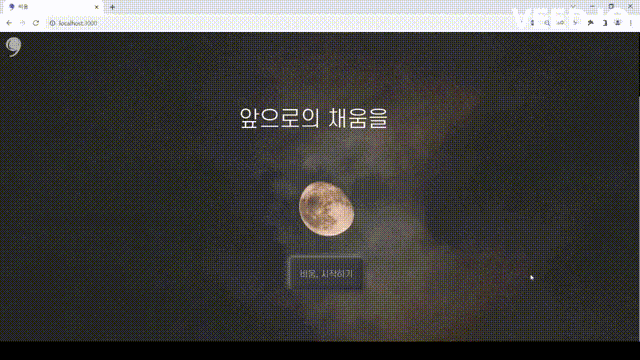
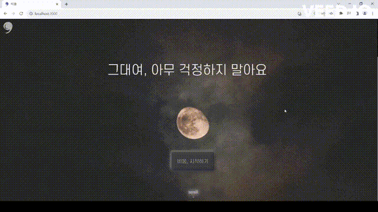
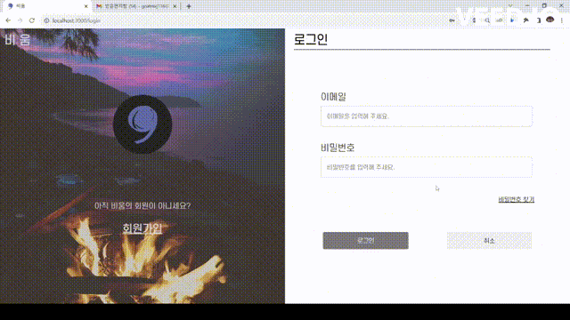
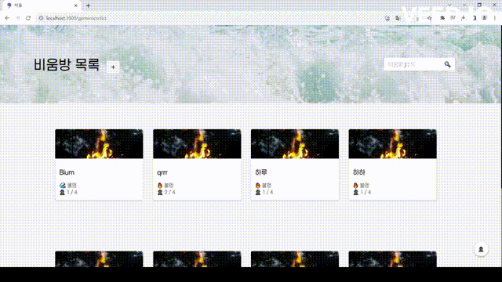
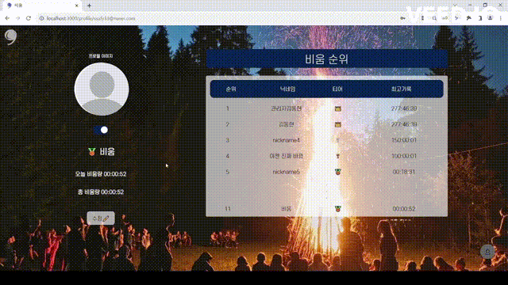
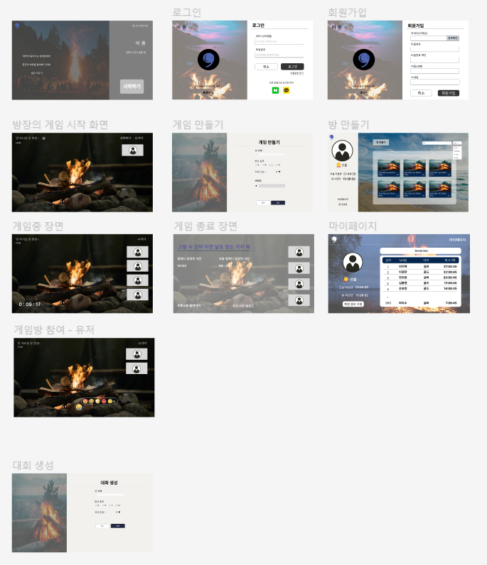
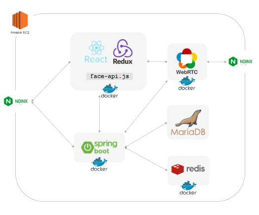
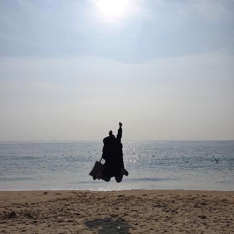
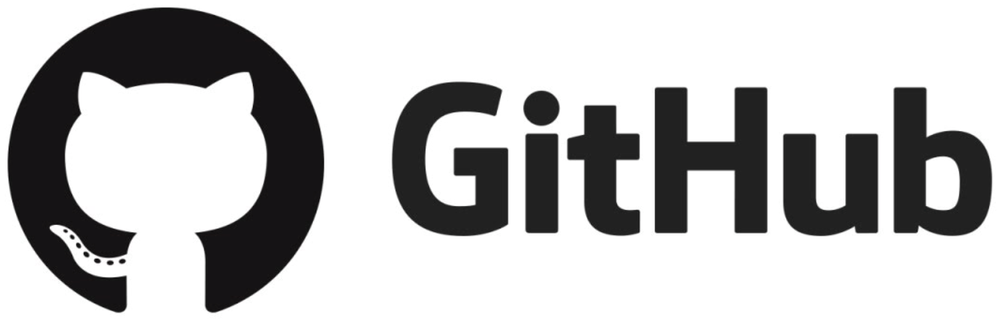

###### 배포 주소

> 📌 https://i9c205.p.ssafy.io

###### 시연 영상

> 📌 광고 https://youtu.be/9n_ocHmlpIk

> 📌 UCC 경진대회 https://youtu.be/aLL42Mf6IVA

# 📌기술 스택

##### Back-End

<div>


</div>

##### Front-End

<div>
 
 
 

</div>

##### DataBase


##### VCS


##### IDE


##### CI/CD

 
 


##### Environment

<div>
 
 
 
 


</div>

# 📌서비스 소개

## 서비스 설명

### 개요

- 서비스 명 : 비움
  - " ((주로 ‘마음, 가슴’ 따위와 함께 쓰여)) 욕심이나 집착 따위의 어지러운 생각을 없애다. " 뜻의 비우다의 명사형
  - 서비스를 통해 생각과 걱정을 비우고 힐링을 채우는 온라인 공간을 제공하고자 하는 의미
- 프로젝트 명 : "심신 안정을 위한 화상 연결" 서비스

### 타겟

> 바쁜 일상 속 잠깐의 쉼과 생각 비우기가 필요한 사람들

# 📌기획 배경

## 배경

- 평소에 얼마나 많은 스트레스를 받으며 살고 있는지를 평가해본 결과, 2명 중 1명(47.9%)이 일상 속 스트레스 수준이 높은 편이라고 응답
  출처 : [데일리팝(http://www.dailypop.kr)](https://www.dailypop.kr/news/articleView.html?idxno=53913)
- 아무것도 하지 않고 아무 생각도 하지 않는 순간이 오히려 사람들의 마음을 위로한다. → 새로운 정신 건강 관리법으로 각광받고 있다.
- 멍 때리기 대회
  - 2014년부터 개최한 대회로 혼자만 멍 때리는 것이 불안한 사람들에게 다 같이 멍을 때리자고 권유하자는 의미가 있다
  - 멍 때리기가 시간 낭비라는 고정관념을 뛰어넘어 마음을 다스리는 방법으로 인정받고 있음
- 자신만의 시간을 보내고 싶어하는 사람들이 증가함
  - 검색 창에 '멍 때리기 좋은 곳'을 검색하면 한적한 관광지, 숙박업체가 추천된다.
  - SNS에서는 조용한 분위기가 일품인 멍 때리기 좋은 곳을 서로 공유하는 경우도 생겨나고 있다.
  - 대한민국 문화체육관광부와 소속기관이 운영하는 문화포털에서는 '서울에서 멍 때리기 좋은 곳'이라는 제목으로 도시 속 색다른 휴식 공간을 소개하며 사람들에게 신선한 정보를 제공

## 목적

- 일상 생활 안에서 생각을 비우며 사람들의 정신 건강 관리를 돕기 위함
- 장소의 제약을 벗어나 영상을 통해 생각을 비울 수 있는 환경을 제공

## 의의

- 누구든지 접속해서 참여할 수 있는 생각 비우기 서비스
- 리프레시 하기 위한 수단

# 📌 데모

###### 필수 사항

```bash
Node.js 18.16.1
SpringBoot 2.7.14
npm 9.5.1
```

###### 권고 사항

- Chorme Browser

###### 설치

```bash
# git clone
git clone https://lab.ssafy.com/s09-webmobile1-sub2/S09P12C205.git
```

###### Back-End

```bash
# backend 폴더로 이동
cd backend
./gradlew build
cd build/libs
ls -arlth
java -jar bium-0.0.1-SNAPSHOT.jar
```

###### Front-End

```bash
# frontend 폴더로 이동
cd frontend
npm i  
npm start
```

# 📌기능 소개

## 주요 기능

⭐ 실시간 라이브 스트리밍 비움

⭐ 회원 관리 (비움 기록 관리, 회원 정보 관리, 랭크 조회)

⭐ face-api.js - 카메라 이탈 인지, 표정 인지

## 세부 기능

- 메인
  - 비움방 목록, 생성
  - 배경 영상과 개인 웹캠 영상 송출
  - 타이머
- 회원
  - 자체 로그인
  - 비밀번호 찾기
  - 비움 기록 확인
  - 마이페이지

# 📌시연 영상

## 메인 페이지

- 비움 시작하기 버튼을 눌러 로그인 페이지로 넘어갑니다.
- 비움의 효능, 비움 서비스를 착안하게 된 계기, 이용 안내 페이지 입니다.

  

## 회원가입, 로그인

- 아이디를 이메일 형식에 맞춰 입력하고 중복 확인을 합니다.
- 모든 정보를 작성한 후 회원가입 버튼을 클릭하면 회원가입이 성공하였다는 알림창이 뜨고 로그인 창으로 넘어갑니다.
- 회원가입한 이메일과 비밀번호를 맞게 입력하고 로그인 버튼을 클릭하면 로그인 성공과 함께 게임 목록 페이지로 이동합니다.

  

## 비밀번호 찾기

- 비밀번호를 찾고 싶은 경우 비밀번호 찾기를 클릭하면 모달창이 뜹니다. 이메일을 입력하고 전송 버튼을 클릭하면 임시 비밀번호가 입력한 이메일로 전송됩니다.

  

## 비움방 검색

- 검색하고 싶은 방 제목을 검색창에 입력하면 검색한 방이 보여집니다.
- 방 생성을 원하는 경우 + 버튼을 클릭하면 방 정보를 작성할 수 있습니다.
- 방 제목을 입력하고 최대인원은 4명까지 설정할 수 있습니다. 불 물 중에 원하는 영상 종류를 선택하고 비밀방 여부도 선택하여 방을 생성합니다.

  

## 비움방 ( 실시간 라이브 스트리밍 비움 )

- 참여자들은 이미 생성된 방 중에 선택하여 입장할 수 있습니다.
- 참여자들은 선택한 방에 입장을 하면 방장이 시작할 때까지 기다립니다.
- 방장이 방 제목, 최대인원 수, 영상 종류를 선택한 후 방을 생성합니다.
- 방장이 시작 버튼을 클릭하면 타이머가 작동되고 bgm이 실행되고 비움을 바로 시작합니다.
- 탈락 규칙에 따라서 탈락 카운트가 되고 총 11번 카운트가 되면 최종 탈락이 됩니다.
- 모든 참여자들이 탈락이 되면 비움 결과가 뜨면서 순위와 각 참여자들의 비움 시간이 나타납니다.

### 참여자


### 방장


## 방해버튼

- Disturb를 클릭하여 빵빠레가 터지면서 방해 기능을 할 수 있습니다.

  

## 마이페이지 ( 비움 기록 확인 )

- 매일 자정에 오늘의 비움량이 리셋되고, 전체 회원들의 순위변동 추이와 티어를 볼 수 있습니다.
- 본인의 티어와 닉네임을 확인할 수 있고 본인이 얼마나 비움을 했는지 오늘 비움량과 총 비움량을 확인할 수 있습니다.
- 회원 정보 수정 버튼을 클릭하면 정보를 수정할 수 있는 모달창이 뜹니다.
- 회원 탈퇴를 원하는 경우 버튼을 클릭하면 비밀번호 입력창이 뜹니다. 본인이 가입할 때 설정한 비밀번호를 입력하면 회원 탈퇴를 할 수 있습니다.

  

# 📌프로젝트 진행 및 산출물

#### 프로젝트 개발 기간

2023.07.17 ~ 2023.08.18

#### 프로젝트 산출물

##### 1. Figma



##### 2. ERD


##### 3. API 설계서

[API 명세서](https://www.notion.so/API-URL-aecc36ea3f3d4a48a830f0fe8a689d4a?pvs=21)

##### 4. 요구사항 정의서

[요구사항 정의서](https://docs.google.com/spreadsheets/d/1NY0yTh26FWAF4gvOKL72EtD5HL4vhLlK1UJVjDhHlrQ/edit#gid=283207649)

##### 5. 시스템 아키텍처



##### 6. Git Flow 브랜치 전략


- Git Flow 사용 브랜치

  - develop: 개발
  - feature: 기능
  - master: 배포
  - hotfix: 에러 수정

- Git Flow 진행 방식

  1. feature 브랜치가 완성되면 develop 브랜치로 pull request
  2. Front-End 팀장, Back-End 팀장이 변경 사항을 체크하여 merge
  3. 큰 기능이 완료될 때 마다 develop 브랜치를 master 브랜치로 병합하여 배포

- feature 브랜치 이름 명명 규칙

  - [ FE / BE ] / [ 기능 이름 ]
    <br> ex) FE/login
    <br> ex) BE/login

##### 7. Jira


- 목적: 협업, 일정, 업무 관리
- 방법
  1. 월요일 오전에 주 단위 계획
  2. 백로그 생성
  3. 스프린트 시작
- 스프린트: 일주일 단위

# 📌개발 멤버

## 개발팀 소개

|                                                                 손효민                                                                 |                                                                김동현                                                                 |                                                               연주원                                                                |                                                               이지혁                                                                |                                                                 이정찬                                                                 |                                                               최지수                                                               |
| :------------------------------------------------------------------------------------------------------------------------------------: | :-----------------------------------------------------------------------------------------------------------------------------------: | :---------------------------------------------------------------------------------------------------------------------------------: | :---------------------------------------------------------------------------------------------------------------------------------: | :------------------------------------------------------------------------------------------------------------------------------------: | :--------------------------------------------------------------------------------------------------------------------------------: |
|                                                                |                                                                |                                                                |                                                                |                                                                |                                                                |
| [](https://github.com/sonhyomin00) | [](https://github.com/DongHyun22) | [](https://github.com/joo1yeon) | [](https://github.com/illu1996) | [](https://github.com/jeongchanim) | [](https://github.com/cjjss11) |
|                                                          **팀장**, BE-Leader                                                           |                                                                  BE                                                                   |                                                                 BE                                                                  |                                                              FE-Leader                                                              |                                                                   FE                                                                   |                                                                 FE                                                                 |
